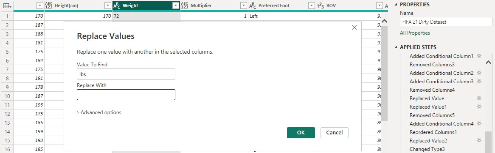

# FIFA-21-Dataset-Cleaning-Using-Power-Bi

# INTRODUCTION
FIFA 21 dataset cleaning exercise was a challenge I took on during a bootcamp, this helped me practice data cleaning in Power bi while improving my data analytics skills too. This challenge is basically for us to improve and enhance our Power bi cleaning skills alongside our overall analytics ability.
## About dataset
It contains the details of football players alongside their performance, updated up till 2021. It is worth noting that there are 18979 rows and 77 columns present in the FIFA 21 data.
It is pertinent to note that cleaning this dataset requires that one has good knowledge of the data category (Football data) which is why further research recommended, you can also study the data dictionary to gain an understanding of every entry therein.
Noting the above will improve the overall efficiency of data after cleaning.
## Objectives
The objectives of this challenge were to 
1. Ensure that all the columns have the correct data type
2. Numerical columns should be in a format suitable for further calculations and analysis
## Skills demonstrated 
skill demonstrated were generally for data cleaning and data transformation using functions from Power bi which includes
1. Power query editor
2. Conditional column
3. Replace values
4. Replace errors
5. Changing of Data type
6. Custom columns
## Analysis tool and data source
This project was carried out using ** POWER BI ** power query editor, while the data was sourced from a data analysis bootcamp I participated in.
## Data Cleaning and Transformation
The data set was first imported into power query editor and loaded for transformation. I then proceeded to fixing the dataset so as to meet my target objectives as listed below
#### ID column 
This column contains the unique ID for each players entered in this datset, no corrections were made

#### Full Name column - 
I wanted the players full name which without abbreviations and special characters so I did as follow
1. I Removed the “Name column” because it contained abbreviated player names, I wanted the names in full
2. Removed the “Photo Url column” because it contained link to players photos which we do not need for this analysis.
3. Removed the “Long Name column” because it contained special characters
4. But split up the “Player Url column” to get out the full names of the players which also do not contain abbreviations using split column by delimiter to split by (\) character which split the column into 7 & other column with one of them containing the players’ name.
5. I then removed all other six columns and renamed the one containing the players name as Full Name

#### Nationality and age column - 
After a run through these columns I considered them okay with no need for corrections.

#### Overall rating and potential rating columns 
Changed or Renamed column “OVA and POT” to OVERALL RATING and POTENTIAL RATING respectively for easier understanding.
#### Club column -
This column was i considered okay and in the right format so I moved to the next column
#### Contract column -
This column contained contract years (the year signed and year to end), loan period and free contract. I derived three columns from here for simplicity during further analysis. The process and columns derived are explained below
1. #### Agreement Column - using Add conditional column the contract column was split the key words with i.e contract loan and free as shown below

3. #### Contract start column and contract end column – The contract column was split into two using split by delimiter (~), after which the errors within each column (contract1 and contract2) formed were replaced with “null” as shown below. I also renamed the columns derived as contract start column and contract end column.

4. #### Duration of contract column – this column was derived by subtracting column 1 (contract start) from column 2 (contract end) using Custom column as shown below.

#### Position column - 
I removed the” Position” column since there was best position column since which we could work with.
#### Height Column - 
The “Height” column contained values in cm, inches and feet so for uniformity, I carried out the following steps using conditional column and replace values as follows.
1. I converted the values in inches and feet into decimal by replacing the feet with decimal(.) and removing the inches using Replace values for both.
2. After that I used conditional column to create a new column (multiplier) for converting the values in feet to cm (multiply by 30.48) and then replaced the cm and changed height column type to whole number.
3. After which I multiplied the two columns to get a column of height in cm.

#### Weight Column - 
The Weight column contained values in kg and lbs so for uniformity, I carried out the following steps using conditional column and replace values as follows.
1. I used conditional column to create a new column (multiplier) for converting the values in lbs to kg (multiply by 0.454) while those already in kg were multiplied by 1
2. Replaced the kg and lbs with nothing so I can change weight column type to whole number
3. after which I multiplied the two columns to get a column of weight in kg renamed Weight(kg)

#### Best overall rating Column - 
I renamed “BOV” column to BEST OVERALL RATING for easier understanding.
#### Best position and joined Column – 
I considered these columns okay and did not require any alteration but removed Loan Date End.
#### Value, Release clause and wages Columns – 
1.	I removed currency, Millon(M), and thousand(K) signs in front of each values and placed in front of the column name using replace values and renamed the columns respectively
2.	I also changed the column type from Text to whole number for Wages and decimals for Values and Release clause for easy during further analysis

#### Attacking – base stats column – 
The columns after the release clause column as listed below, I considered okay after checking and found no issues
#### Attacking, Crossing, Finishing, Heading Accuracy, Short Passing, Volleys, Skill, Dribbling, Curve, FK Accuracy, Long Passing, Ball Control, Movement, Acceleration, Sprint Speed, Agility, Reactions, Balance. Power, Shot Power, Jumping, Stamina, Strength, Long Shots, Mentality, Aggression	, Interceptions, Positioning, Vision, Penalties, Composure, Defending, Marking, Standing Tackle, Sliding Tackle, Goalkeeping, GK Diving, GK Handling, GK Kicking, GK Positioning, GK Reflexes, Total Stats, Base Stats.
#### W/F, SM, AW, DW and IR columns –
1.	I renamed the above columns as follows, W/F – weak foot, SM – Skill moves, AW – Attacking Work rate, DW – Defensive Work rate, IR – International reputation.
2.	Changed the column type from text to whole number for W/F, SM, and IR

#### Pac, Sho, Dri, Def, Phy Columns -
1. I renamed these columns as follows for clarity PAC - Pace, SHO - Shoot, DRI -Dribbling, DEF – Defense
2. Finally, I removed Def and because we have a column for defending already.
## Conclusion 
Participating in this bootcamp has helped me practice my data-cleaning skill and afforded me the opportunity to learn more while at it. I have learnt new concepts and procedures along the line, and despite how tasking it was I have been able to transform the data into a state that is ready for analysis. 

